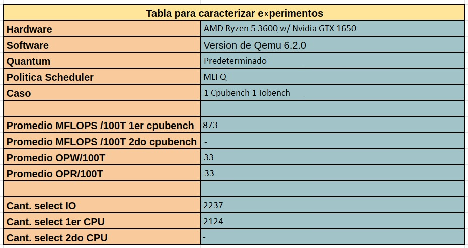
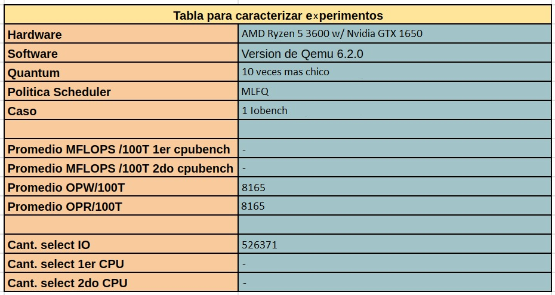

## Informe que responde la primera parte del laboratorio.

#### 1- Que politica de planificacion utiliza xv6-riscv para elegir el proximo proceso a ejecutarse?

Analizando el codigo podemos determinar que la politica de planificacion que utiliza xv6 se trata de Round Robin. Esto basado en el hecho de que no sale de forma normal de la funcion Scheduler, si no que se realizan interrupciones luego de ciertos intervalos que se determinan en start.c

Esto implica la existencia de un Quantum de tiempo, y al no existir una cola de prioridades o una forma de determinar si un proceso debe ejecutarse por sobre otro, si no que todos tienen la misma posibilidad de 
ejecutarse podemos determinar que se trata de Round Robin.

---
#### 2- Cuanto dura un Quantum en xv6-riscv?

El Quantum en xv6-riscv como mencionamos en el ejercicio anterior, se determina en el archivo start.c, en donde se define la variable interval, la cual es la que determina el tiempo de cada Quantum. En este caso podemos observar que interval posee el valor de **1000000 cycles (1ms), o 1/10 de segundo**.

```c

void
timerinit()
{
  // each CPU has a separate source of timer interrupts.
  int id = r_mhartid();

  // ask the CLINT for a timer interrupt.
  int interval = 1000000; // cycles; about 1/10th second in qemu.
  *(uint64*)CLINT_MTIMECMP(id) = *(uint64*)CLINT_MTIME + interval;

  // prepare information in scratch[] for timervec.
  // scratch[0..2] : space for timervec to save registers.
  // scratch[3] : address of CLINT MTIMECMP register.
  // scratch[4] : desired interval (in cycles) between timer interrupts.
  uint64 *scratch = &timer_scratch[id][0];
  scratch[3] = CLINT_MTIMECMP(id);
  scratch[4] = interval;
  w_mscratch((uint64)scratch);

  // set the machine-mode trap handler.
  w_mtvec((uint64)timervec);

  // enable machine-mode interrupts.
  w_mstatus(r_mstatus() | MSTATUS_MIE);

  // enable machine-mode timer interrupts.
  w_mie(r_mie() | MIE_MTIE);
}

```
--- 
#### 3- Cuanto dura un cambio de contexto en xv6-riscv?

Para conocer el **tiempo de duracion** de un cambio de contexto, podemos ir reduciendo gradualmente los ciclos del quantum de hasta que ningun proceso pueda ejecutarse. Esto lo hacemos ya que en la finalizacion de cada time slice se realiza un cambio de contexto, por lo que buscamos apretar el tiempo lo suficiente como para que unicamente se haga un cambio de contexto y asi poder medir su tiempo.
En general cambia en relacion al respectivo hardware pero serian aproximadamente un poco menos de **1000 ciclos**.

--- 

#### 4- El cambio de contexto consume tiempo de un Quantum?

Si, ya que el Quantum esta establecido de **forma global**, lo que quiere decir que el Quantum se rige para todo el Sistema Operativo y no es particular de cada proceso. Por lo mismo, cualquier operacion que se realice en el SO consumira tiempo de Quantum y por lo tanto, el cambio de contexto tambien.

---
#### 5- Hay alguna forma de que a un proceso se le asigne menos tiempo?
Como el quantum se realiza de **forma global**, puede suceder que un proceso termine de ejecutarse antes de que la interrupcion suceda, por lo que al proximo proceso, se le asignaria el tiempo restante hasta que se concrete la interrupcion.

---

#### 6- ¿Cúales son los estados en los que un proceso pueden permanecer en xv6 riscv y que los hace cambiar de estado?

**UNUSED** :
- Se le asigna a un proceso al ser inicializado (procinit).
- Se le asigna a un proceso al ser liberado (freeproc).

**USED** :
- Se le asigna a un proceso cuando encontramos uno sin usar y le reservamos memoria (allocproc).

**SLEEPING** :
- Se le asigna a un proceso cuando queremos bloquear sus funciones (sleep).

**RUNNABLE** :
- Se le asigna a un proceso cuando se inicializa uno de usuario (userinit).
- Se le asigna a un proceso cuando lo dejamos listo para que el planificador decida cuando ejecutarlo (yield).
- Se le asigna a un proceso cuando desbloqueamos su funcionamiento posterior a un sleep (wakeup)

**RUNNING** :
- Se le asigna a un proceso cuando el planificador decidio ejecutarlo (scheduler).

**ZOMBIE** :
- Se le asigna a un proceso cuando An exited process remains in the zombie state
// until its parent calls wait().

---

## Segunda Parte:
### Introduccion:

Lo mas complejo de esta parte fue la implementacion de la syscall pstat la cual fue llevada a cabo empleando 3 campos agregados por nosotros en la estructura del proceso.

- **p->priority** : Indica la prioridad de ejecucion de un proceso, como estamos trabajando en RR, no es algo necesario ya que todos poseen exactamente la misma.

- **p->contador** : Indica la cantidad de veces que el proceso fue elejido por el planificador  (incrementado dentro del scheduler antes de que el estado del proceso sea asignado a running).

- **p->lst**: 
  Indica la ultima vez que fue ejecutado el proceso (implementado, antes de que el estado del proceso sea asignado a running en scheduler) utilizando la variable ticks que cuenta la cantidad de veces que se realizo una interrupcion hasta el momento de su llamado. vamos actualizando el campo hasta que el planificador llame por ultima vez al proc.

```c
uint64 
sys_pstat()
{
  int pid;
  argint(0, &pid);
  
  struct proc *p = myproc();
  acquire(&p->lock);
  printf("Priority of process: %d \n",p->priority);
  printf("Number of times run: %d \n",p->contador);
  printf ("Last time executed: %d \n",p->lst);
  release(&p->lock);
return 1;
}
```

### Punto 1:
- #### Caso 1: Solo un iobench:

  

  **Descripcion del escenario:**
  En este caso tenemos que el proceso Iobench es elegido por el scheduler 467531 veces, ya que este proceso cuando se ejecuta hace unicamente operaciones de I/O. 
  Cuando el proceso necesita esperar una entrada o salida, el proceso pasa a estar en estado Sleep, entonces libera la CPU antes del quantum.
  Entonces es elegido tantas veces ya que mientras espera los procesos I/O, esos espacios son ocupados por mas I/O.

- #### Caso 2: Solo un cpubench:

  

  **Descripcion del escenario:**
  En este caso tenemos el proceso Cpubench unicamente, el cual es elegido 2135 veces. Este proceso requiere unicamente la CPU y usara todo el quantum para ejecutar. Realiza 645 MFLOPS en 100 ticks de cpu. Si hacemos 2135 * 1/10s nos daria 213,5 y
  213,5 / 60 nos da 3,558 minutos que es aproximadamente lo que tardo en realizarse el proceso Cpubench.

- #### Caso 3: 1 iobench; 1 cpubench:

  

  **Descripcion del escenario:**
  En el caso donde tengamos 1 proceso Cpubench y 1 proceso IObench. El proceso IObench es elegido 3420 veces y el Cpubench es elegido 2098 veces.
  Podemos notar que el proceso Cpubench se elige mas veces que cuando era el unico proceso, ya que mientras que el proceso IObench esta en SLEEP, esperando I/O el proceso Cpubench se ejecuta en esos lapsos. No quiere decir que se ejecuta mas tiempo, de hecho es menos, pero es elegido mas veces por el scheduler.

- #### Caso 4: 2 cpubench:

  

  **Descripcion del escenario:**
  En el caso donde tengamos 2 procesos Cpubench, tenemos el 1ero fue elegido 1050 veces y el segundo 1051 veces. 1050+1051= 2101. Es decir que los procesos se eligen al rededor de 30 veces menos que en el caso donde tenemos un solo Cpubench. Esto se debe a que cuando cambias entre procesos, el context switch consume tiempo tambien, entonces esas 30 veces menos que se hicieron son el costo de cambiar entre el proceso 1 y 2.

- #### Caso 5: 2 cpubench 1 iobench:

  

  **Descripcion del escenario:**
  En el caso de 2 procesos Cpubench y 1 IObench sucede algo similar que el caso 3. Pero ahora el proceso IObench es elegido menos veces, ya que compite con otro proceso mas (Recordemos que RR no tiene prioridad). Y cada proceso Cpubench es elegido la misma cantidad de veces, ya que el scheduler va a ir alternando
  entre estos dos procesos para que ultilicen los "tiempos muertos" que brinda el proceso IObench y tambien para que se ejecuten normalmente. Como ya mencionamos
  anteriormente, la suma de los dos procesos Cpubench es menor que el Cpubench del caso 3, por los costos del context switch.

---

### Punto 2: Repetir el experimento para Quantums 10 veces mas cortos:
- #### Caso 1: Solo un iobench:

  

- #### Caso 2: Solo un cpubench:

  

- #### Caso 3: 1 cpubench; 1 iobench :

  

- #### Caso 4: 2 cpubench:

  


- #### Caso 5: 2 cpubench 1 iobench:

  

### Conclusion:

Analisis de experimentos con quantum 10 veces mas chico = 1/100s.

En el caso 1 el Iobench se ejecuta aproximadamente las mismas veces porque como el Iobench libera la CPU antes de que se termine el quantum, con el quantum 10
veces mas chicos no se distingue el cambio. En el caso 2 el Cpubench se ejecuta 21160 veces, si eso lo multiplicamos por el tamaño del quantum y lo dividimos 
en 60 (para tener el resultado expresado en minutos), nos vuelve a dar 3,5 minutos.

Entonces, podemos concluir:
- Al ser los quantums mas cortos, vamos a tener que seleccionar el proceso una cantidad de veces considerablemente mas alta que con el time slice normal, debido a que el scheduler debe elegirlo con mayor frecuencia para poder asi finalizar con su ejecucion.
- Que los procesos sean elegidos una mayor cantidad de veces no significa que su tiempo de ejecucion sea mayor, ya que como las Time slices son menores, se requieren muchos mas cambios de contexto y eso significa tiempo de ejecucion tambien.
- En los casos donde tengamos procesos Cpubench aumenta la cantidad de MFLOPS.
- En los casos donde tengamos procesos IObench aumenta la cantidad de OPW y OPR.
---

## Tercera Parte:

### Implementacion de las reglas MLFQ:

- **Para la R3** : Lo primero que vimos fue _donde_ se inicializa un proceso de usuario dentro de XV6.
Buscando dimos con que la funcion **_userinit_** toma un proceso y realiza todas aquellas operaciones necesarias para que el proceso este listo para ejecutarse, dentro de esas operaciones notamos que en **_allocproc_** cuando un proc no esta en uso, va a una guarda que se encarga de setear todos aquellos campos necesarios para la inicializacion del mismo, por lo tanto fue alli donde nosotros agregamos lo siguiente: 
  
  ```c
  found:
    p->pid = allocpid();
    p->state = USED;
    p->priority = NPRIO-1;
    p->contador = 0;
    p->lst = 0;
  ```
- Para la R4, al aprender del anterior laboratorio que la syscall sleep bloquea el proceso, nos dirijimos a ella y agregamos lo siguiente:
  ```c
  if (p->priority < NPRIO-1){
    p->priority++;
  }
  // Go to sleep.
  p->chan = chan;
  p->state = SLEEPING;
  ```

Tan solo realizando estas modificaciones el rastreo de prioridad de los procesos fue exitoso.
---

## Cuarta Parte:

Para implementar la politica de planificacion MLFQ implementamos una nueva estructura que funciona como una proctable, en la misma tenemos los siguientes campos:
```c
struct pqueue{
  struct proc proc[NPROC];                // array de procesos
  struct proc *proc_queue[NPRIO][NPROC];  // queue de prioridades de procesos
  uint pos_prio[NPRIO];                   // pos actual en cada queue
  uint total_size;                        // cant total de procesos en pqueue
  uint max_priority;
  struct spinlock qlock;
} pq;
```
Donde: 
- **struct proc proc[NPROC]** = Arreglo donde en cada indice tenemos un proceso.
- **struct proc *proc_queue[NPRIO][NPROC]** = Arreglo de dos dimensiones donde en cada indice se encuentra un proc que tiene asociada una prioridad 0, 1 o 2. Sobre este vamos a hacer la gestion de procesos, actualizando sus prioridades y volviendo a agregarlos en otras posiciones, al igual que tomar procesos anteriormente agregados en las prioridades mas altas para ser ejecutados.
- **uint pos_prio[NPRIO]** = Arreglo que sirve para conocer el cardinal de procesos asociados a una prioridad.
- **uint max_priority** = Campo donde guardamos la maxima prioridad que tiene un proceso en el momento de ejecucion (Si tenemos un proceso con prio 1 y otro con prio 0, en max_priority se encuentra 1).
- **struct spinlock qlock** = Para impedir el acceso de otros procesadores al mismo proceso.
- **uint total_size** = Cantidad total de procesos en la pqueue.

Para poder administrar esta proc table creamos dos funciones:
- **Enqueue** (Empleada cada vez que a un proceso se le asigna el estado runnable)
```c
void enqueue(struct proc *pr){
  uint prio = pr->priority;

  pq.proc_queue[prio][pq.pos_prio[prio]] = pr;
  
  pq.pos_prio[prio]++;
  pq.total_size++;

  if(prio > pq.max_priority){
    pq.max_priority = prio;
  }
}
``` 
La cual va introduciendo al arreglo de dos dimensiones el proceso con su prioridad actualizada. 
- **Dequeue** (Utilizada para indicarle al scheduler que proceso ejecutar).
```c
struct proc *dequeue(){
  
  uint prio = pq.max_priority;

  if(pq.pos_prio[prio] == 0){
    return 0;
  }

  acquire(&pq.proc_queue[prio][pq.pos_prio[prio]-1]->lock);

  struct proc *res;

  if (pq.pos_prio[prio] == 1){
    res = pq.proc_queue[prio][0];
    pq.proc_queue[prio][0] = 0;
    pq.pos_prio[prio]--;
  } else {
    res = pq.proc_queue[prio][0];

    for(uint i = 0 ; i < pq.pos_prio[prio]; i++){
      pq.proc_queue[prio][i] = pq.proc_queue[prio][i+1];
    }
    pq.proc_queue[prio][pq.pos_prio[prio]] = 0;
    
    pq.pos_prio[prio]--;  
    
  }

  pq.total_size--;
  
  while(pq.max_priority != 0 && pq.pos_prio[pq.max_priority] == 0){
    pq.max_priority--;
  }

  return res;
}
```
El cual devuelve el proceso con la prioridad mas alta existente.

### ¿Se puede producir starvation?

Como vimos en la parte teorica de la materia, la existencia del priority boost evita el starvation dentro del MLFQ, al no estar implementado si, se puede producir, por poner un ejemplo, al tener los iobench siempre una prioridad mayor a los cpubenchs, si no dejan de llegar, el segundo sera ejecutado solo un quantum y luego de eso nunca mas.

### Punto 1: Repetir experimentos con MLFQ:

- #### Caso 1: Solo un iobench:

  

- #### Caso 2: Solo un cpubench:

  

- #### Caso 3: 1 cpubench; 1 iobench :

  

- #### Caso 4: 2 cpubench:

  


- #### Caso 5: 2 cpubench 1 iobench:

  

### Conclusion:
Analisis de experimentos en MLFQ con Quantum predeterminado.

Podemos notar que en el caso 1, 2 y 3 tenemos tablas muy parecidas a RR, el principal cambio de mlfq es implementar las prioridades y en caso 1 y 2
trabajamos con un solo proceso y en caso 3 trabajamos con 2 procesos Cpubound que siempre tendran las mismas prioridades.

En los otros casos, el proceso IObench tendra siempre mas prioridad para ejecutrase que los procesos Cpubench, pero como IObench libera la CPU antes
de terminar su quantum, se elige muchas veces a Cpubench para que siga ejecutandose.

--- 

### Punto 2: Repetir experimentos con MLFQ y Quantum 10 veces mas cortos:

#### Caso 1: Solo un iobench:

  

#### Caso 2: Solo un cpubench:

  

#### Caso 3: 1 cpubench; 1 iobench :

  

#### Caso 4: 2 cpubench:

  

#### Caso 5: 2 cpubench 1 iobench:

  

### Conclusion:

Analisis de experimentos en MLFQ con Quantum 10 veces mas chicos.

Las conclusiones que podemos sacar a partir de estas tablas, son muy parecidas a las conclusiones con RR. El principal cambio de Mlfq ya los vimos impactados
en las otras tablas, analizando como el scheduler elige que proceso ejecutar de acuerdo a su prioridad. La diferencia la podemos notar en que la cantidad de MFLOP de 
operaciones de Cpubench no varian exageradamente, como si las hacen las operaciones OPW y OPR de iobench.